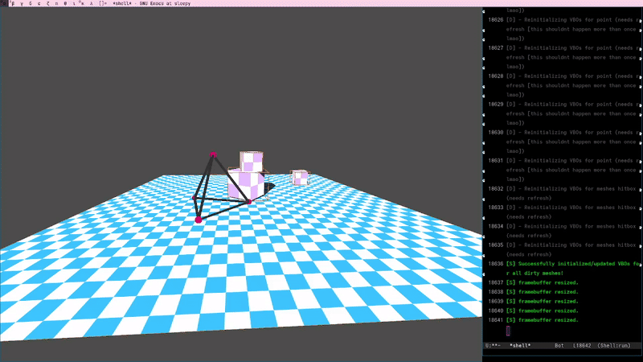

# cortex engine

A powerful and lightweight 3D renderer built in C++ and OpenGL, supporting a wide range of features listed down below.

The focus of this project is to have an agile engine, i can use to develop my own physics engine / showcase various data science concepts like 3d points clouds, map data etc all in my own ecosystem.

Everything is coded from scratch, trying to implement everything in the way i would do as much as possible.

The only Libraries used are GLFW (xlib is terrible), OpenGL, and STB image to load pngs.

---

##  Features

-  Foreward rendering
-  Physically Based Rendering (PBR)
-  Support for GLTF/GLB models / full scenes including materials / positioning/
-  Custom abstraction, making the engine suitable for easy expansion.
-  Animation system for Camera animations / cutscenes using control points and interpolating between them
-  Primitive Physics engine consising of: Point physics(gravity, drag, conditional), Spring constraints and more to come soon. 

---

## More readme coming soon :-)
